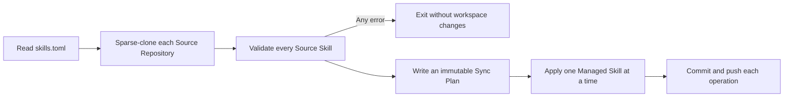

# Skill Collection

This repository mirrors explicitly selected skills from public GitHub repositories into `skills/`. The checked-in `skills.toml` Manifest is authoritative, and `skills.lock` records the source commit and content identity of every Managed Skill.



## Manifest

Each TOML table names a public GitHub repository and a path inside it. Each entry maps the destination Managed Skill name to its Source Skill directory name:

```toml
["owner/repository"."path/to/many-skills"]
local-name = "upstream-name"
another-name = "another-upstream-name"

["other-owner/other-repository"."."]
root-skill = "source-directory"
```

The updater enforces these invariants:

- Source repositories must be public GitHub repositories.
- Every Source Skill is a direct child of its Source Path and contains a regular `SKILL.md`.
- Managed Skill names are globally unique without regard to case.
- A Source Skill can map to only one Managed Skill.
- Source paths, symlinks, submodules, and special files cannot escape or enter a Managed Skill.
- `skills/` contains only directories represented by valid Lock Records.
- Comments carry no state. Removing or commenting out a mapping schedules its Managed Skill for deletion.

The entire Source Skill directory is mirrored, including dotfiles and executable bits. Files removed upstream are removed locally on the next update.

## Commands

The updater requires Python 3.11 or newer, Git, and an authenticated `gh` CLI. It intentionally has no third-party Python runtime dependencies.

```fish
# Plan and apply every pending operation locally.
uv run --python 3.11 python update_skills.py

# Validate and report without writing. Exit 0 means no changes, 1 means changes, and 2 means an error.
uv run --python 3.11 python update_skills.py check

# Build a reusable plan, then apply its operations in the order listed in operations.tsv.
uv run --python 3.11 python update_skills.py plan --output .skill-update-plan
uv run --python 3.11 python update_skills.py apply-one --plan .skill-update-plan --skill managed-name

# Run the offline integration tests.
uv run --python 3.11 python -m unittest discover -s tests -v
```

`plan` resolves each Source Repository's default branch to a commit, validates all configured Source Skills, and copies their payloads into the plan directory. `apply-one` verifies that the Manifest, Lock Records, selected payload, and Managed Skill have not changed since planning.

## Automation

`.github/workflows/update-skills.yml` runs at minute 17 every four hours in UTC and can also be started manually. It uses `ubuntu-latest`, the latest Python selected by `3.x`, and the `v7` major tags of the official checkout and setup-python actions. These are deliberately moving environments rather than reproducible patch pins.

After the offline tests and a successful global plan, each Sync Operation is applied, committed, and pushed independently in Managed Skill name order. Commit messages use this form:

```text
chore(skills): <add|update|delete> <managed-name> from <owner/repository> (source: <source-name>)
```

The workflow writes its result to the GitHub Actions job summary. It does not create issues or pull requests, and it does not run on ordinary pushes. GitHub may automatically disable scheduled workflows in a public repository after 60 days without repository activity; re-enable the workflow manually if that occurs.

The workflow uses the repository `GITHUB_TOKEN` and supports public Source Repositories only. It sets `contents: write` solely to push generated commits back to `main`.

## Licensing

The updater preserves license and attribution files contained inside each Source Skill, but it does not decide whether a source permits redistribution. The Manifest maintainer is responsible for that decision. This repository intentionally has no root license yet.
